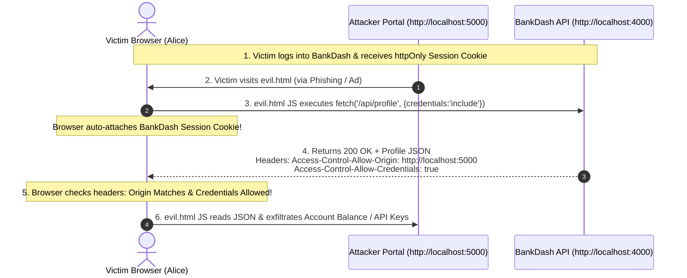
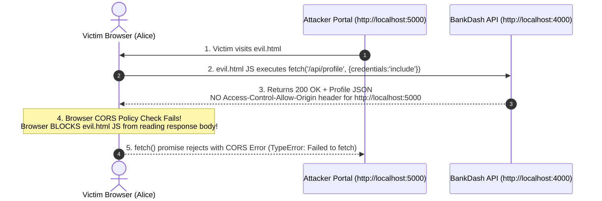

# CS_LAB_2 

# CORS Misconfiguration — Interactive Vulnerability Lab & Remediation

**App:** BankDash — Demo Banking Dashboard & Security Lab
**Vulnerability Class:** CORS Misconfiguration (Reflected Origin + Credentials Enabled)

## Video Demo

[Watch the Video Demo](https://drive.google.com/file/d/1BhYwIZDM3SvPiMQrZpxmYbx0bUgjvHb7/view?usp=drive_link)

---

## 1. Background: Same-Origin Policy (SOP) & CORS


The **Same-Origin Policy (SOP)** is a fundamental browser security boundary: JavaScript running on `https://attacker.com` cannot read HTTP responses from `https://bankdash.com` unless `bankdash.com` explicitly allows it via response headers.

### Cross-Origin Resource Sharing (CORS) Headers:
- `Access-Control-Allow-Origin: <origin>` — Specifies which requesting origin is allowed to read the response.
- `Access-Control-Allow-Credentials: true` — Indicates whether browser cookies/session credentials may be attached to cross-origin requests and whether the response may be read when credentials are sent.
- `Vary: Origin` — Ensures shared HTTP caches do not serve a cached CORS response generated for one origin to a request coming from a different origin.

> [!CAUTION]
> **The Critical Flaw (Reflected Origin + Credentials):**
> If a server reflects whatever `Origin` header the client sends in `Access-Control-Allow-Origin` **AND** sets `Access-Control-Allow-Credentials: true`, it permits **any web application on the internet** to make credentialed requests using the victim's session cookies and extract the full response.

---

## 2. Architecture & Attack Flow Diagrams

### Vulnerable CORS Flow (Data Exfiltration)



### Remediated CORS Flow (Browser SOP Block)



---

## 3. Interactive Security Lab & Walkthrough

The project includes an **Interactive CORS Control Panel** that allows live toggling between the Vulnerable state and the Remediated state.

### Quick Start Guide

1. **Start the BankDash Victim Server:**
   ```bash
   cd victim-app
   npm install
   npm start
   # Runs on http://localhost:4000
   ```

2. **Start the Attacker Portal:**
   ```bash
   cd attacker-site
   python3 -m http.server 5000
   # Runs on http://localhost:5000
   ```

3. **Step-by-Step Lab Walkthrough:**
   - Open `http://localhost:4000` in your browser.
   - Log in with default credentials (`alice@example.com` / `hunter2`).
   - Notice the **Security Lab Control Panel** badge displaying `🔴 VULNERABLE (Reflected Origin)`.
   - Open `http://localhost:5000/evil.html` in a **new tab** while keeping BankDash open.
   - Observe `evil.html` successfully exfiltrating Alice's account number, balance, PAN, and live API key (`🚨 DATA EXFILTRATED`).
   - Return to `http://localhost:4000` and click **Toggle CORS Mode** to switch to `🟢 SECURE (Allowlist Enforced)`.
   - Return to `http://localhost:5000/evil.html` and click **Execute Attack**.
   - Observe the browser blocking access (`🛡️ BLOCKED BY BROWSER SAME-ORIGIN POLICY`).

---

## 4. Vulnerable Code vs. Remediated Code

### Vulnerable Implementation (`victim-app/server.js`)
```javascript
// BUG: Blindly reflects the client's Origin header + allows credentials
app.use((req, res, next) => {
  const origin = req.headers.origin;
  if (origin) {
    res.header('Access-Control-Allow-Origin', origin);       // ❌ Reflects anything
    res.header('Access-Control-Allow-Credentials', 'true');  // ❌ Permits cookies cross-origin
  }
  next();
});
```

### Remediated Implementation (`victim-app/server.fixed.js.snippet`)
```javascript
const ALLOWED_ORIGINS = ['http://localhost:4000'];

app.use((req, res, next) => {
  const origin = req.headers.origin;
  
  // ✅ Only grant CORS access if origin is explicitly on the allowlist
  if (origin && ALLOWED_ORIGINS.includes(origin)) {
    res.header('Access-Control-Allow-Origin', origin);
    res.header('Access-Control-Allow-Credentials', 'true');
    res.header('Vary', 'Origin'); // ✅ Prevents shared cache poisoning
  }
  
  res.header('Access-Control-Allow-Methods', 'GET,POST,OPTIONS');
  res.header('Access-Control-Allow-Headers', 'Content-Type');

  if (req.method === 'OPTIONS') return res.sendStatus(204);
  next();
});
```

---

## 5. Automated Verification Suite

Run the included automated test suite to programmatically verify CORS header behavior across both modes:

```bash
cd victim-app
node test-cors.js
```

### Output:
```
🧪 Starting CORS Security Lab Verification Suite...

  ✅ PASS: BankDash server is up on http://localhost:4000

--- Testing VULNERABLE CORS Mode ---
  ✅ PASS: Vulnerable mode reflects untrusted origin (http://localhost:5000)
  ✅ PASS: Vulnerable mode enables credentials (cookies)

--- Toggling to FIXED CORS Mode ---

--- Testing FIXED CORS Mode (Attacker Origin) ---
  ✅ PASS: Fixed mode blocks unauthorized origin (http://localhost:5000)

--- Testing FIXED CORS Mode (Legitimate Origin) ---
  ✅ PASS: Fixed mode allows legitimate origin (http://localhost:4000)
  ✅ PASS: Fixed mode allows credentials for legitimate origin
  ✅ PASS: Fixed mode includes Vary: Origin header

========================================
Summary: 6 Passed, 0 Failed
========================================
```

---

## 6. Key Takeaways & Defense-in-Depth

1. **Never combine wildcard (`*`) or reflected origins with `Access-Control-Allow-Credentials: true`.**
2. **Maintain a strict server-side allowlist** of trusted origins.
3. **Always set `Vary: Origin`** whenever dynamically populating `Access-Control-Allow-Origin` from an allowlist to avoid cache poisoning attacks.
4. **Implement Anti-CSRF Tokens** for state-changing endpoints (`POST`/`PUT`/`DELETE`) as a defense-in-depth layer against unauthorized cross-site requests.
